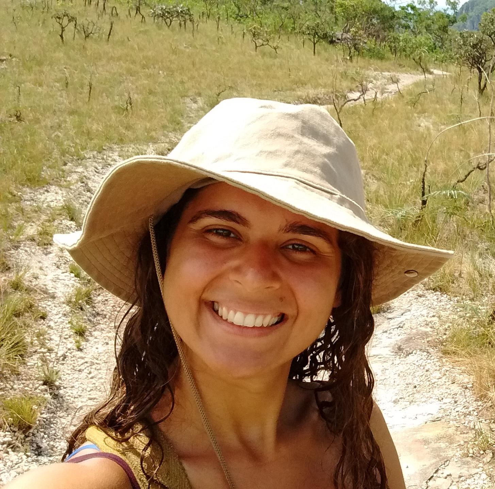

Email: gablimat [at] ucm [dot] com | gabriellatabett [at] gmail [dot] com  
[Personal website](https://gabriellatabett.wordpress.com/home/)  
[Google scholar](https://scholar.google.com/citations?user=1qaThTYAAAAJ&hl=en)  
[Orcid](https://orcid.org/0000-0002-4961-1297)  
[ResearchGate](https://www.researchgate.net/profile/Gabriella-Tabet-Cruz)  
[LinkedIn](http://www.linkedin.com/in/gabriellatabet)  
[Brazilian CV (Lattes)](http://lattes.cnpq.br/0868161924412747)  
[Figshare](https://figshare.com/authors/Gabriella_L_Tabet_Cruz/12902756)  

## Hi there 👋

I’m a researcher exploring parasite–host interactions in wildlife, with a focus on how ecological, phylogenetic, and climatic factors shape these relationships. I also work on organizing biological databases and applying multi-criteria and network-based analytical tools to extract integrated ecological, environmental, and health insights.

## Interests

Community Ecology; Macroecology; Network Science; Disease Ecology; Biostatistics

## Education

M.S. in Science (Biodiversity and Health) — Oswaldo Cruz Institute, Rio de Janeiro, Brazil

Specialization in Environment — Federal University of Rio de Janeiro, Rio de Janeiro, Brazil

B. S. Biology — Federal University of Rio de Janeiro, Rio de Janeiro, Brazil

## Publications

[Trait profiles and taxonomy predict zoonotic microparasite occurrences on potential hosts and geographic distribution](https://doi.org/10.1016/j.pecon.2025.10.003)  
**CRUZ, G.L.T.**; WINCK, G.; ANDREAZZI, C. S. Perspectives in Ecology and Conservation, 2025.

[From host individual traits to community structure and composition: Bartonella infection insights](https://doi.org/10.1186/s13071-024-06523-y)  
**CRUZ, GABRIELLA LIMA TABET**; GONÇALVES-OLIVEIRA, JONATHAN; DE LEMOS, ELBA REGINA SAMPAIO; D’ANDREA, PAULO SERGIO ; DE ANDREAZZI, CECILIA SILIANSKY. Parasites & Vectors, v. 17, p. 440, 2024.

[Integrating databases for spatial analysis of parasite-host associations and the novel Brazilian dataset](https://doi.org/10.1038/s41597-023-02636-8)  
**CRUZ, GABRIELLA L. T.**; WINCK, GISELE R.; D’ANDREA, PAULO S.; KREMPSER, EDUARDO; VIDAL, MARIANA M.; ANDREAZZI, CECILIA S.  Scientific Data, v. 10, p. 757, 2023.

[Socioecological vulnerability and the risk of zoonotic disease emergence in Brazil](https://doi.org/10.1126/sciadv.abo5774)  
WINCK, GISELE R.; RAIMUNDO, RAFAEL L. G.; FERNANDES-FERREIRA, HUGO; BUENO, MARINA G.; D’ANDREA, PAULO S. ; ROCHA, FABIANA L.; **CRUZ, GABRIELLA L. T.**; VILAR, EMMANUEL M.; BRANDÃO, MARTHA; CORDEIRO, JOSÉ LUÍS P.; ANDREAZZI, CECILIA S. SCIENCE ADVANCES, v. 8, p. 1-11, 2022.

[Integrando dados e modelos de redes eco-evolutivas e socioeconômicas para entender e prever surtos de doenças tropicais negligenciadas](https://doi.org/10.57810/lattedata/ODBRQG)  
WINCK, G.; **CRUZ, G. L. T.**; ANDREAZZI, C. S.; KREMPSER, E.; D'ANDREA, P. S. LattesData v.2. 2022.

[Chapter 3: Biological Diversity and Ecological Networks in the Amazon](https://doi.org/10.55161/DGNM5984)  
Zapata-Ríos G, Andreazzi CS, Carnaval AC, Doria CRC, Duponchelle F, Flecker A, Guayasamín JM, Heilpern S, Jenkins CN, Maldonado C, Meneghelli D, Miranda G, Moraes R M, Silman M, Silveira MAPA, **Tabet G**, Trujillo F, Ulloa Ulloa C, Arieira J. In: Nobre C. et al. (Eds). Amazon Assessment Report 2021. United Nations Sustainable Development Solutions Network, New York, USA. Available from https://www.theamazonwewant.org/spa-reports/.
